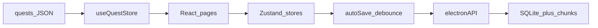

# Описание ArtQuest (для контекста ИИ)

Скопируйте блок ниже целиком.

---

## Что это за приложение

**ArtQuest** — десктопное (и частично веб) приложение для **геймифицированного обучения рисованию и анимации**. Пользователь выполняет творческие задания (квесты), загружает работы, качает навыки по дереву скиллов, собирает достижения, ведёт стрики и прогресс. Стек: **Electron 42 + React 19 + TypeScript + Vite + Zustand 5 + Tailwind 3**. Сборка: `electron-builder`. Тесты: Vitest + Testing Library.

Целевая аудитория: художники/аниматоры, которым нужна структура практики (ежедневные задания, каталог, статистика), а не просто список упражнений.

---

## Архитектура и состояние

**Роутинг:** `HashRouter` в [`src/renderer/App.tsx`](src/renderer/App.tsx).

**Zustand-сторы:**
- `useQuestStore` — каталог квестов, пользовательские квесты, завершения, галерея работ, логи завершений, ежедневные/недельные челленджи, кампания, очередь попапов достижений, микро-челленджи, переопределения названий.
- `useUIStore` — настройки, стрик, адаптивная сложность, расписание spaced review, статистика фидбека, кампания RPG (золото/материалы), загрузка/сохранение/сброс прогресса, онбординг, ошибки сохранения.
- `useSkillStore` — дерево навыков (ноды), XP/уровни/престиж, достижения, проверка ачивок.
- `useThemeStore` — тема UI (`modern` | `light` | `rpg`).
- `usePortraitStore` — косметика портрета, ежедневный сундук, streak shield.
- `useQuestSessionStore` — таймер сессии квеста (основная + опциональная reference-фаза 15 мин).
- `useSkillPracticeStore` — таймер практики на ноде скилла.

**Кросс-стор:** действия вызывают `useXStore.getState()` вне рендера. Прогресс собирается в `buildProgressData()` и сохраняется единым снимком.

**Автосохранение:** `initAutoSave()` в App — подписка на все сторы, debounce ~2 с, инкрементальные чанки; каждые N сохранений — полный снимок; `beforeunload` → синхронное сохранение.

**Схема прогресса:** версия **v12** ([`src/shared/progressSchema.ts`](src/shared/progressSchema.ts)), валидация Zod. Поля включают: квесты, скиллы, стрик, learning path, quest review schedule, feedback stats, campaign RPG, косметику и т.д.

**Персистентность:**
- **Electron:** SQLite + чанковые инкрементальные сохранения ([`src/main/localDb.ts`](src/main/localDb.ts)); fallback на `progress.json`.
- **Браузер:** `localStorage` через `browserProgress.ts`, если нет `window.electronAPI`.
- **IPC** через preload [`src/preload/preload.ts`](src/preload/preload.ts): save/load (async + sync), галерея (save/read images), экспорт/импорт JSON, Google Drive, tray, уведомления, внешние ссылки.

---

## Экраны (маршруты)

| Маршрут | Назначение |
|---------|------------|
| `/` | **Dashboard** — сводка дня, ежедневные квесты, стрик, быстрые действия, share-card |
| `/quests` | Каталог всех квестов с фильтрами |
| `/quests/:id` | Деталь квеста: таймер, референсы, загрузка работы, сдача |
| `/campaign` | Кампания (карта мира/зон) — если выбран campaign/mixed path |
| `/gallery` | Галерея загруженных работ |
| `/skills` | Дерево навыков + практика на нодах |
| `/progress/stats` | Статистика |
| `/progress/timeline` | Таймлайн/календарь завершений |
| `/progress/achievements` | Сетка достижений |
| `/progress/accessories` | Косметика портрета |
| `/resources` | Каталог материалов (видео YouTube и ссылки) |
| `/settings` | Настройки, бэкап, облако, доступность |

Редиректы: `/statistics` → `/progress/stats`, `/achievements` → `/progress/achievements`.

**Навбар:** десктоп — полное меню; мобильный — нижние табы (урезанный набор). В навбаре виджеты активной сессии квеста и практики скилла.

**Глобальные оверлеи:** попапы достижений, тосты XP/level-up, баннер ошибки сохранения, онбординг-тур, модалка learning profile, soft restart после 14+ дней неактивности, подсказки, панель референсов на странице квеста.

---

## Квесты

**Источник данных:** 7 JSON-файлов категорий в [`src/renderer/data/`](src/renderer/data/) (drawing, anatomy, animation, effects, storytelling, character_design, environment), загрузка через `loadAllQuests()`, дедуп по `id`.

**Категории (7):** drawing, anatomy, animation, effects, storytelling, character_design, environment.

**Сложности:** novice → intermediate → advanced → master → expert.

**Поля квеста:** id, code, title/description (EN+RU), xp, estimatedTime, tags, prerequisites (id других квестов), min_level, medium (traditional/digital/both), is_repeatable, review_after_days, microChallenges и др.

**Пользовательские квесты:** создание в модалке, id ≥ порога, можно удалять.

**Фильтры каталога:** категория, сложность, теги (в URL), recommended vs all, пагинация.

**Гейты:** prerequisites и min_level игрока.

**Ежедневные квесты (3 в день, 4 в день восстановления стрика):** детерминированная генерация по локальной дате; учитывают избранные категории, learning path, spaced-review квест «на повтор».

**Недельный челлендж:** один квест на ISO-неделю + бонус XP при завершении.

**Микро-челленджи:** опциональные подзадачи внутри квеста.

**Сдача квеста (`completeQuest`):**
1. Начисление quest XP + skill XP от времени практики
2. Запись в `questCompletionLogs` (неограниченный массив — для ачивок)
3. Обновление completed/daily/weekly состояния
4. XP в ноду скилла (по тегам или целевой ноде)
5. Проверка скрытых и обычных достижений
6. Если все дневные сделаны — бонус XP, стрик, прогресс косметического сундука
7. Кампания/RPG при campaign path
8. Spaced review schedule если `review_after_days > 0`
9. Агрегация post-quest feedback
10. `saveProgressSync()`

**UI сдачи:** загрузка изображения/видео, минуты практики (из таймера), заметки, опциональный фидбек (сложность 1–5 + критерии).

**Референсы:** YouTube/Pinterest, боковая панель на детальной странице.

---

## Навыки (Skills)

Большое **дерево нод** по категориям ([`skillTree.ts`](src/renderer/data/skillTree.ts)). У каждой ноды: уровень, XP, опционально prestige после макса, `reviewIntervalDays` для повторного просмотра.

**Практика:** отдельная сессия с таймером на выбранной ноде.

**Уровень игрока:** сумма уровней всех нод. **Ранги:** novice → apprentice → journeyman → master → legend.

---

## Кампания и learning path

При первом запуске: **learning profile** (`drawing` скрывает animation в каталоге / `animation`), затем **path**: `explore` | `campaign` | `mixed`, пол аватара.

**Campaign:** карта мира/зон/квестов, главы из [`data/campaign/`](src/renderer/data/campaign/). **RPG-слой:** золото, материалы, экипировка, сила для босс-нод.

---

## Spaced repetition

Квесты с `review_after_days` попадают в расписание повторов (`questReviewSchedule` + логи завершений). Алгоритм SM-2-lite. Просроченный review-квест может попасть в ежедневную тройку.

Отдельно — **skill review** по `lastReviewDate` на нодах.

---

## Геймификация

- Quest XP, skill XP, daily bonus (+50% XP за все дневные)
- Стрик по дням (все дневные выполнены); **streak shield** раз в месяц из портрета
- Ежедневный **косметический сундук** после полного дня
- **100+ достижений** + скрытые (по тегам, времени суток, speed run и т.д.)
- **Speed run:** практика < половины estimatedTime
- **Адаптивная сложность:** веса категорий из flow-метрик
- **Share card:** PNG со стриком/уровнем с дашборда

---

## Галерея и облако

Режимы хранения: `local`, `local_and_cloud`, `cloud_only`. **Google Drive:** OAuth, очередь загрузок, sync/retry из настроек. Галерея: сетка/группировка, lightbox, фильтр по категории.

---

## Resources (материалы)

Курируемый каталог YouTube-видео + ленивая подгрузка расширенного каталога. Фильтры: категория, нода скилла, теги, каналы, избранное. Пользовательские ссылки на ноды.

---

## i18n и темы

Языки: **en**, **ru** ([`translations.ts`](src/renderer/i18n/translations.ts)); RU дополняется из EN через deep-merge. Хелперы для title/description квестов, категорий, сложностей.

Темы: **modern**, **light**, **rpg** (CSS `data-theme` + custom properties).

Доступность в настройках: масштаб шрифта, контраст, reduce motion.

---

## Electron-специфика

- System tray, сворачивание в трей при закрытии
- Запуск с ОС, локальные напоминания (час/минута)
- Single-instance lock
- Сохранение медиа на диск, `show-item-in-folder`, `open-external`
- Экспорт/импорт прогресса через нативные диалоги
- Звуки UI + опциональный ambient loop

В браузере без Electron всё то же по UI, но сохранение в localStorage и без нативных диалогов/трея/облака (с guards `window.electronAPI?.`).

---

## Поток данных (упрощённо)

---

## Ключевые файлы для навигации по коду

- App/routes: [`src/renderer/App.tsx`](src/renderer/App.tsx)
- Сторы: [`src/renderer/store/`](src/renderer/store/)
- Модели: [`src/renderer/store/models.ts`](src/renderer/store/models.ts)
- Main/IPC: [`src/main/main.ts`](src/main/main.ts)
- Preload: [`src/preload/preload.ts`](src/preload/preload.ts)
- Схема прогресса: [`src/shared/progressSchema.ts`](src/shared/progressSchema.ts)
- Страницы: [`src/renderer/pages/`](src/renderer/pages/)
- Конвенции: [`AGENTS.md`](AGENTS.md)

---

## Команды разработки

- `npm run dev` — Vite без Electron
- `npm run electron:dev` — Electron dev
- `npm run test` — Vitest
- `npm run electron:build` — сборка установщика
