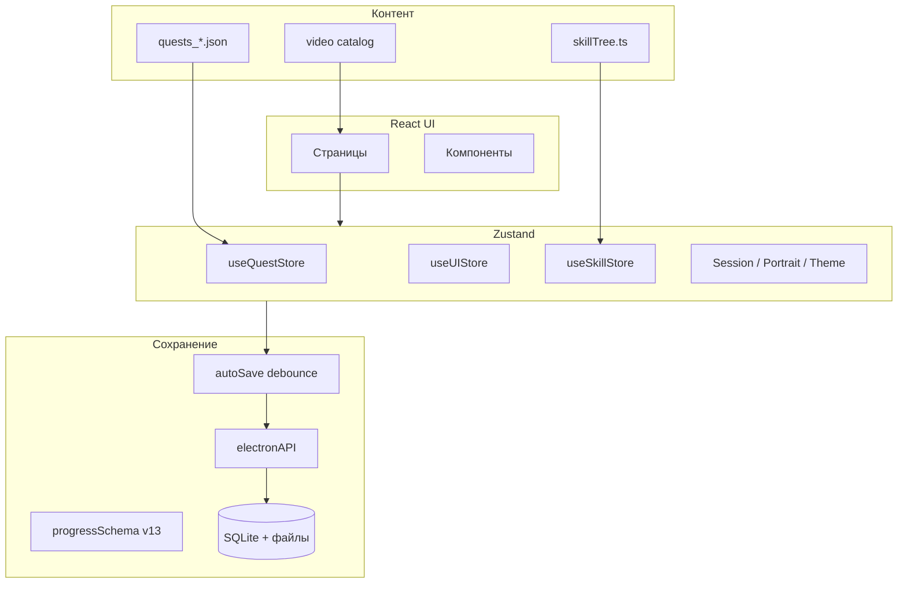

# ArtQuest — описание приложения и проделанной работы

**Версия документа:** 1.0  
**Дата:** май 2026  
**Продукт:** ArtQuest 1.0.0  
**Платформа:** Windows (Electron), частично — веб-режим (Vite без нативных API)

---

## 1. Назначение и идея продукта

**ArtQuest** — десктопное приложение для **геймифицированного обучения рисованию и анимации**. Оно объединяет:

- структурированный **каталог творческих заданий (квестов)** с уровнями сложности и зависимостями;
- **дерево навыков** с прокачкой по категориям;
- **ежедневную и недельную** практику;
- **галерею работ**, достижения и статистику;
- **библиотеку материалов** (видео и внешние источники референсов).

Целевая аудитория — художники и аниматоры, которым нужна не просто «список упражнений», а **ритм практики**, обратная связь через XP/стрики и понятная навигация по навыкам.

Приложение работает **локально-first**: прогресс хранится на устройстве пользователя; облачная синхронизация галереи (Google Drive) — **опциональна**.

---

## 2. Технологический стек

| Слой | Технологии |
|------|------------|
| Оболочка | **Electron 42** |
| UI | **React 19**, **TypeScript**, **Vite 5**, **electron-vite** |
| Маршрутизация | **react-router-dom 6** (`HashRouter`) |
| Состояние | **Zustand 5** (несколько независимых store) |
| Стили | **Tailwind CSS 3**, CSS-переменные тем, отдельные модули (`settings.css`, `resources.css`, RPG-тема) |
| Валидация данных | **Zod 3** (схема прогресса, миграции версий) |
| Сборка дистрибутива | **electron-builder 26** (portable `.exe` + NSIS-установщик) |
| Тесты | **Vitest**, **Testing Library**, **Playwright** (e2e, опционально) |
| Линтинг | **ESLint 9** + TypeScript ESLint |
| Опционально | **sharp** — генерация иконок/портретов |

**Языки интерфейса:** русский и английский (i18n с deep-merge RU ← EN).

**Темы оформления:** `modern` (тёмная), `light` (светлая), `rpg` (тёплая «игровая» тёмная с золотыми акцентами).

---

## 3. Архитектура приложения

### 3.1. Процессы Electron

```
┌─────────────────────────────────────────────────────────────┐
│  Main process (Node.js)          src/main/                  │
│  • Окно приложения, tray, уведомления                       │
│  • SQLite + файловое хранилище прогресса и галереи          │
│  • IPC: save/load, изображения, экспорт, Google OAuth       │
└──────────────────────────┬──────────────────────────────────┘
                           │ IPC
┌──────────────────────────▼──────────────────────────────────┐
│  Preload (contextBridge)           src/preload/             │
│  • Безопасный API window.electronAPI для renderer           │
└──────────────────────────┬──────────────────────────────────┘
                           │
┌──────────────────────────▼──────────────────────────────────┐
│  Renderer (React SPA)              src/renderer/            │
│  • Страницы, компоненты, Zustand, данные квестов/видео      │
└─────────────────────────────────────────────────────────────┘

         Общий код: src/shared/  (схема прогресса, merge чанков)
```

### 3.2. Управление состоянием (Zustand)

| Store | Ответственность |
|-------|----------------|
| `useQuestStore` | Каталог квестов, пользовательские квесты, завершения, галерея, логи, ежедневные/недельные задания, микро-челленджи |
| `useUIStore` | Настройки, стрик, загрузка/сохранение/сброс прогресса, онбординг, адаптивная сложность, spaced review расписание |
| `useSkillStore` | Дерево навыков (ноды), XP, уровни, престиж, достижения |
| `useThemeStore` | Текущая тема UI |
| `usePortraitStore` | Косметика портрета, ежедневный сундук, streak shield |
| `useQuestSessionStore` | Таймер сессии квеста (фазы: работа / референсы) |
| `useSkillPracticeStore` | Таймер практики на выбранной ноде навыка |

Прогресс **собирается единым снимком** (`buildProgressData()` в `useUIStore`) и сохраняется через IPC.

### 3.3. Автосохранение

- Подписка на все store при старте (`initAutoSave` в `App.tsx`).
- Debounce **~2 секунды** после изменений.
- **Инкрементальные чанки** (`incrementalSave.ts`) + полный снимок каждые 12 инкрементальных сохранений.
- При закрытии окна — синхронное сохранение (`beforeunload`).

### 3.4. Схема прогресса

- Версия схемы: **v13** (`src/shared/progressSchema.ts`).
- При загрузке старых сохранений выполняется **миграция** (`migrateProgressPayload`).
- Удалённые ранее поля режима «кампании» очищаются при миграции (режим кампании в текущей версии **не используется**).

**Персистентность:**

- **Electron:** SQLite + чанки; fallback на `progress.json` при необходимости.
- **Браузер (без Electron):** `localStorage` через `browserProgress.ts`.

---

## 4. Структура репозитория

```
artquest/
├── src/
│   ├── main/           # Electron main, IPC, БД, Google Drive
│   ├── preload/        # contextBridge API
│   ├── shared/         # progressSchema, progressChunkMerge
│   └── renderer/       # React UI
│       ├── pages/      # Экраны (Dashboard, Quests, Skills, …)
│       ├── components/ # UI-компоненты
│       ├── store/      # Zustand
│       ├── data/       # JSON квестов, skill tree, видеокаталог
│       ├── utils/      # Бизнес-логика (квесты, уровни, материалы, звук)
│       ├── i18n/       # Переводы EN/RU
│       └── styles/     # CSS, темы
├── scripts/            # Генерация квестов, валидация, сборка ассетов
├── public/sounds/      # UI-звуки (WAV)
├── build/              # Иконки для Windows
├── docs/               # Документация (в т.ч. этот файл)
└── dist-artquest*/     # Собранные билды (по номерам итераций)
```

---

## 5. Экраны и маршруты

| Маршрут | Экран | Назначение |
|---------|--------|------------|
| `/` | **Главная (Dashboard)** | Сводка дня, ежедневные квесты, стрик, портрет, быстрые действия |
| `/quests` | **Квесты** | Каталог с фильтрами (категория, сложность, теги) |
| `/quests/:id` | **Деталь квеста** | Таймер, референсы, загрузка работы, сдача |
| `/skills` | **Навыки** | Дерево нод, практика с таймером |
| `/gallery` | **Галерея** | Работы пользователя (локально / облако) |
| `/resources` | **Материалы** | Видеокаталог и внешние источники |
| `/progress/stats` | **Статистика** | Метрики практики |
| `/progress/timeline` | **Таймлайн** | Календарь завершений |
| `/progress/achievements` | **Достижения** | Сетка ачивок |
| `/settings` | **Настройки** | Профиль, тема, звук, бэкап, облако, доступность |

Редиректы: `/statistics` → `/progress/stats`, `/achievements` → `/progress/achievements`.

**Глобальные оверлеи:** попапы достижений, тосты XP/level-up, онбординг, модалка профиля обучения, мягкий перезапуск после долгого перерыва, панель референсов на странице квеста.

---

## 6. Контент и игровые системы

### 6.1. Квесты

- **Источник:** 7 JSON-файлов по категориям (`quests_drawing`, `quests_anatomy`, `quests_animation`, `quests_effects`, `quests_storytelling`, `quests_character_design`, `quests_environment`).
- Загрузка: `loadAllQuests()` с дедупликацией по `id`.
- **Категории (7):** drawing, anatomy, animation, effects, storytelling, character_design, environment.
- **Сложности:** novice → intermediate → advanced → master → expert.
- Поля: XP, время, теги, prerequisites, min_level, повторяемость, micro-challenges, review_after_days и др.
- **Пользовательские квесты** с отдельным диапазоном ID, редактирование/удаление.

**Ежедневные квесты (3 в день):** детерминированная генерация по локальной дате (`dailyQuestGenerator.ts`); учитываются избранные категории, уровень игрока, spaced review.

**Недельный челлендж:** один квест на ISO-неделю.

**Сдача квеста:** начисление XP, запись в лог, обновление скиллов и достижений, стрик, опциональный фидбек (сложность 1–5).

### 6.2. Навыки (Skill Tree)

- Большое дерево нод в `skillTree.ts` с привязкой к категориям.
- У ноды: уровень, XP, престиж, интервал повторного просмотра.
- **Уровень игрока** = сумма **пикового эффективного уровня по каждой категории** (не сумма всех нод — это предотвращает «раздувание» уровня).
- **Ранги:** novice → apprentice → journeyman → master → legend.

### 6.3. Spaced repetition

- Квесты с `review_after_days` попадают в расписание повторов.
- Просроченные review-квесты могут включаться в ежедневную тройку.
- Отдельно — skill review по датам на нодах.

### 6.4. Геймификация

- Quest XP, skill XP, бонус за выполнение всех дневных.
- **Стрик** по дням; streak shield из системы портрета.
- **100+ достижений**, в т.ч. скрытые.
- Ежедневный **косметический сундук** после полного дня.
- Адаптивные веса категорий из метрик фидбека.
- Звуки UI и опциональный ambient loop.

### 6.5. Портрет и косметика

- Выбор пола портрета в настройках.
- Аксессуары (шляпы, очки) открываются через систему наград / сундука.
- Отображение на главной странице.

---

## 7. Материалы (Resources)

Экран **Материалы** — централизованный доступ к обучающему контенту по фильтрам: категория, узел навыка, теги, поиск.

### 7.1. Режимы источников

| Режим | Описание |
|-------|----------|
| **Длинные** | Курируемый каталог YouTube + пользовательские ссылки |
| **Короткие** | Shorts по тегам узла + помеченные shorts в каталоге |
| **CSP Tips** | Поиск на [Clip Studio TIPS](https://tips.clip-studio.com/) по тегам |
| **Sketchfab** | 3D-модели на [Sketchfab](https://sketchfab.com/) по тегам |
| **Pinterest** | Пины на [Pinterest](https://www.pinterest.com/) по тегам |

Для внешних источников генерируются **карточки-запросы** (как для Shorts): по тегам узла, предпочтительным тегам из URL и тексту поиска (`materialTagSearchQueries.ts`, `materialExternalCatalog.ts`). Клик открывает поиск в системном браузере.

Каталог YouTube: ядро + ленивая подгрузка расширенной библиотеки; виртуализация длинных списков.

### 7.2. Референсы в квесте и практике

Кнопка **«Нужны референсы?»** на странице квеста и в практике навыка открывает выбор:

- **YouTube** → переход в Материалы с фильтрами квеста/ноды;
- **Pinterest**, **CSP Tips**, **Sketchfab** → внешний поиск с бонусом времени на фазу референсов (15 мин).

---

## 8. Галерея и облако

| Режим хранения | Поведение |
|----------------|-----------|
| `local` | Только диск пользователя |
| `local_and_cloud` | Локально + синхронизация с Google Drive |
| `cloud_only` | Приоритет облака |

**Google Drive:** OAuth, папка ArtQuest/Gallery, синхронизация из настроек, открытие папки в браузере.

Изображения и видео работ сохраняются в userData; в галерее — превью, фильтры, lightbox.

---

## 9. Настройки

Секции (двухколоночная сетка на широком экране):

1. **Персонализация** — профиль обучения (рисование/анимация), портрет, избранные категории, тема, язык.
2. **Техническое** — экспорт/импорт JSON, хранилище, Google Drive, звук, ambient, десктоп (трей, автозапуск, напоминания), доступность (масштаб шрифта, контраст, reduce motion), сброс прогресса.

UI настроек унифицирован классами `settings-page`, `settings.css` — **одинаковые размеры шрифтов и кнопок** во всех темах, включая RPG (исправлен конфликт глобальных стилей `.heading-2`).

---

## 10. Electron-специфика

- Иконка в трее, сворачивание в трей (настраивается).
- Запуск с Windows, локальные напоминания.
- Single-instance lock.
- Нативные диалоги экспорта/импорта прогресса.
- `openExternal` для ссылок YouTube, Pinterest, CSP, Sketchfab.
- Без внешней аналитики по умолчанию.

---

## 11. Качество и тестирование

- **332+ unit/integration тестов** (Vitest): store, генератор дневных квестов, схема прогресса, материалы, UI smoke.
- `npm run check` = lint + `tsc --noEmit` + tests.
- CI-скрипт валидации квестов: `npm run validate:quests`.

---

## 12. Сборка и доставка

```bash
cd D:\artquest
npm run electron:build
# или с явным каталогом вывода:
npm run electron:build -- --config.directories.output=D:/artquest/dist-artquest17
```

**Артефакты:**

- `ArtQuest.exe` — portable;
- `ArtQuest Setup 1.0.0.exe` — установщик NSIS;
- `win-unpacked/` — распакованная версия.

Итерации сборок сохраняются в `D:\artquest\dist-artquest{N}\` (например, `dist-artquest17` — актуальная на момент последних правок UI материалов и настроек).

---

## 13. Поток данных (упрощённо)



---

## 14. Ключевые файлы для разработчиков

| Область | Путь |
|---------|------|
| Точка входа UI | `src/renderer/main.tsx`, `App.tsx` |
| Сторы | `src/renderer/store/` |
| Модели настроек | `src/renderer/store/models.ts` |
| Схема прогресса | `src/shared/progressSchema.ts` |
| Main / IPC | `src/main/main.ts` |
| Preload API | `src/preload/preload.ts` |
| Квесты | `src/renderer/data/quests_*.json`, `quests_data.ts` |
| Материалы | `src/renderer/pages/Resources.tsx`, `utils/materialExternalCatalog.ts` |
| Настройки | `src/renderer/pages/Settings.tsx`, `styles/settings.css` |
| i18n | `src/renderer/i18n/translations.ts` |
| Конвенции | `AGENTS.md` |

---

## 15. Выполненные доработки (итог итераций)

Ниже — сводка значимых изменений, релевантных для отчётности:

1. **Материалы:** режимы Long / Short / CSP Tips / Sketchfab / Pinterest; поиск по тегам узла; единый UI переключателей источников.
2. **Референсы:** расширен блок «Нужны референсы?» (YouTube, Pinterest, CSP Tips, Sketchfab) в квестах и практике навыков.
3. **Настройки:** приведение RPG-темы к тем же размерам шрифтов и кнопок, что в light/modern; отдельный `settings.css`.
4. **Прогресс и баланс:** корректный расчёт уровня игрока (пик по категории); мягкий перезапуск после долгой неактивности без потери галереи.
5. **Очистка:** удалён устаревший режим «кампании» из кода и миграций сохранений.
6. **Качество:** тесты и lint без ошибок; регулярные Windows-билды в `dist-artquest*`.

---

## 16. Приватность и безопасность

- Прогресс и медиа по умолчанию **на устройстве пользователя**.
- Google Drive — только при явном подключении аккаунта.
- Нет встроенной телеметрии/аналитики сторонних сервисов.
- Экспорт прогресса — JSON под контролем пользователя (опционально с медиа).

---

## 17. Заключение

ArtQuest — полноценное **offline-first desktop-приложение** с богатым игровым слоем вокруг практики рисования и анимации. Архитектура разделена на main/preload/renderer, состояние централизовано в Zustand с версионированной схемой сохранений, контент масштабируется через JSON и курируемые каталоги. Экран материалов и система референсов связывают обучение внутри приложения с внешними профессиональными ресурсами (YouTube, Clip Studio, Sketchfab, Pinterest) через единый теговый поиск.

---

*Документ подготовлен для отчётности о проделанной работе. При обновлении продукта рекомендуется синхронизировать номер версии схемы (`CURRENT_PROGRESS_SCHEMA_VERSION`) и список маршрутов в `App.tsx`.*
